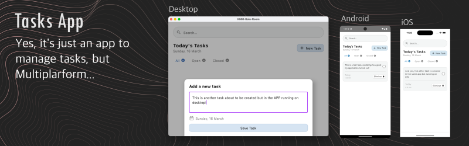

  <h3>
    <strong>Task Manager (Android, iOS & Desktop) [Shared UI]</strong>
  </h3>
  

# ✨ Feature

Application developed to implement the integration of Room and Koin libraries together with Jetpack Compose and Kotlin Multiplatform, allowing to run applications on Desktop, Android and iOS sharing logic and interface.

# 🚀 Tech Stack

- Jetpack Compose, Material UI, Kotlinx.datetime
- Koin
- Room, SQLiteBundled